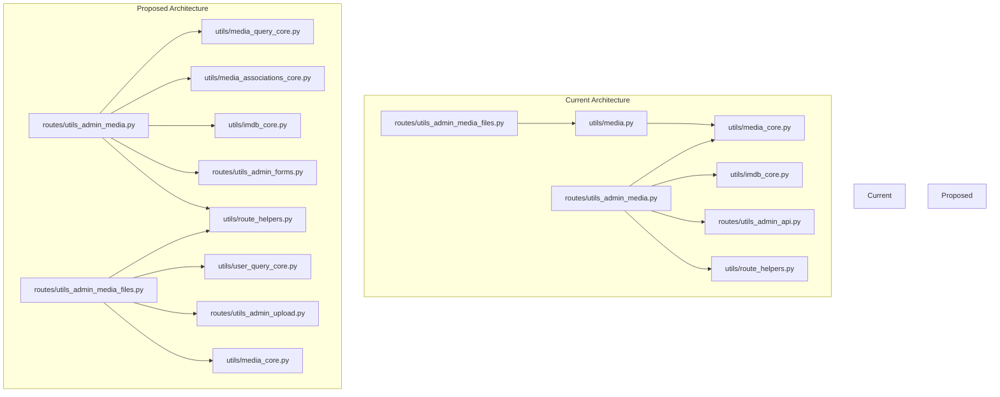

## 1) Inconsistencies with Existing Architecture

### Core vs Presentation Separation Issues
- The plan correctly identifies the need to separate Flask-aware code from core business logic, but there are inconsistencies in how this is applied:
  - In `utils/media_core.py`, there are already functions that mix concerns (eg, `_created_sort_tuple`, `_title_tuple` which are used for sorting but are in the core module)
  - The plan suggests creating `utils/media_query_core.py` but doesn't address the existing sort helper functions already in `media_core.py`

### MediaFileHandler Pipeline Inconsistency
- The plan suggests using MediaFileHandler directly in `upload_media_post_util()`, but the current implementation already has a pipeline-based approach with MediaFileHandler
- The plan doesn't account for the fact that MediaFileHandler already uses atomic writes and path traversal protection

## 2) Unnecessary Complexity

### Over-Engineering Pagination
- The plan suggests two separate pagination functions (`paginate_query` and `paginate_results`) when the existing implementation in `media_management_util()` already handles pagination correctly
- The separation between SQL-level and Python-level pagination adds complexity without clear benefits

### Redundant Association Processing
- While the plan correctly identifies the ~200 lines of duplicated code for processing genres, directors, and performers, it proposes a complex parameterized function
- The proposed `process_media_associations` function has too many parameters and tries to handle too many different cases

### Excessive Response Formatting Functions
- The plan proposes adding 6 new response formatting functions to `utils/route_helpers.py` when the existing `handle_util_result()` function already handles most cases
- Functions like `build_validation_error_response`, `build_success_response`, etc. add unnecessary abstraction

## 3) Missing Considerations

### Template Compatibility
- The plan doesn't fully address how the refactored code will maintain compatibility with existing templates
- For example, the pagination structure in templates might need changes if the implementation is modified

### Error Handling Consistency
- The plan doesn't address how to maintain consistent error handling across the refactored modules
- The existing code has extensive try-catch blocks and error logging that would need to be preserved

### Testing Strategy
- While the plan mentions creating unit tests, it doesn't provide a clear strategy for testing the refactored components
- The existing code has complex interactions between modules that would be difficult to test in isolation

## 4) Specific Implementation Issues

### IMDb Integration
- The plan suggests using `utils/imdb_core.py` via BaseApiProvider instead of `routes/utils_admin_api.py`, but doesn't explain how this transition would work
- The existing code already uses `imdb_search_admin` which calls `utils.imdb_core` functions

### File Upload Processing
- The plan suggests using MediaFileHandler directly instead of the `process_uploaded_files` adapter, but doesn't address the fact that the current implementation already uses MediaFileHandler internally
- The `upload_media_post_util()` function would need significant restructuring to use MediaFileHandler directly

## 5) Recommendations for Improvement

1) Simplify the pagination approach by using a single pagination function that can handle both SQL and Python-level pagination
2) Reduce the number of response formatting functions by extending the existing `handle_util_result()` function
3) Create a more focused association processing function that handles the specific use cases without excessive parameterization
4) Develop a clear migration strategy for template compatibility
5) Create a comprehensive testing strategy that covers both unit and integration tests
6) Address the existing inconsistencies in `utils/media_core.py` before adding new modules

## 6) Mermaid Diagram: Current vs Proposed Architecture

