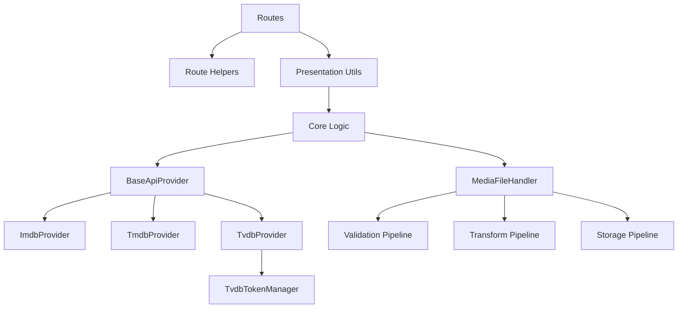

# Make a plan to simplify one part of this application

## Cascade: External API Providers
**Current State**: 3 separate implementations (IMDb, TMDB, TVDB)
- Duplicate authentication logic
- Duplicate token caching (TVDB has 2 separate implementations)
- Duplicate error handling
- Duplicate request/response formatting

**Insight**: "All external APIs are HTTP requests with auth tokens"

**Proposed Solution**: Single `BaseApiProvider` class
- Unified token management (cache, refresh, expiry)
- Standard error handling patterns
- Common request/response formatting
- Configuration-driven endpoints

**Cascade Eliminates**:
- 6 duplicate authentication functions
- 4 duplicate token management functions
- Multiple error handling blocks
- 3 separate configuration patterns

**Files Affected**:
- `utils/api_tmdb/utils_tmdb_core.py`
- `utils/api_tvdb/tvdb_utils.py`
- `utils/api_tvdb/tvdb_extended.py`
- `utils/api_tvdb/tvdb_search.py`
- `utils/imdb_core.py`

Goal: Make a detailed plan to simplify (remove unnecessary complexity) one part of this application as shown below.
- "Complexity/simplification": use the rules in `@/.roo/docs/simplification.md`.
- Use all resources you deem helpful, including but not limited to
    - `.@/agents.md`
    - `codebase_search`
CRITICAL to Keep in mind:
- IMDB is used in this application. Keep active and fully operational.
- TVDB and TMDB are not currently in use but may be used later:
    - Do not enable them.
    - Do not delete them.

## Cascade: Media File Operations
**Current State**: 21 duplicate functions across `utils/media.py` and `utils/media_core.py`
- `validate_file`, `allowed_file` (2 implementations each)
- `generate_unique_filename`, `get_file_hash`, `get_file_size_mb` (2 each)
- `process_uploaded_files`, `save_uploaded_file`, `delete_media_files` (2 each)
- `generate_thumbnail`, `create_upload_directories`, `get_media_metadata` (2 each)

**Insight**: "All file operations are: validate → transform → store/retrieve"

**Proposed Solution**: Single `MediaFileHandler` with pipeline pattern
- Validation pipeline (type, size, hash)
- Transform pipeline (thumbnail, metadata)
- Storage pipeline (unique naming, directories)

**Cascade Eliminates**:
- 21 duplicate function implementations
- Multiple validation approaches
- Inconsistent error handling

**Files Affected**:
- `utils/media.py`
- `utils/media_core.py`
- `routes/utils_admin_media.py`
- `routes/utils_user_media.py`

## Cascade: Response Patterns
**Current State**: Partially standardized via `route_helpers.py`, but inconsistent usage
- Some routes use `handle_util_result()`
- Others manually construct responses
- API endpoints have separate JSON response patterns
- Error responses vary by context

**Insight**: "All responses are: success/failure + data + message + optional redirect"

**Proposed Solution**: Extend route_helpers to cover ALL response types
- Unified `ApiResponse` class for all endpoints
- Standard error response format
- Automatic flash message handling
- Consistent redirect logic

**Cascade Eliminates**:
- Manual response construction in 30+ route functions
- Inconsistent error messaging
- Duplicate JSON serialization

**Files Affected**:
- All files in `routes/` directory
- `utils/route_helpers.py` (extend)

## Cascade: TVDB Token Management Duplication
**Current State**: Identical functions in 2 files
- `authenticate()` - duplicated in `tvdb_extended.py` and `tvdb_search.py`
- `load_token()` - duplicated
- `save_token()` - duplicated  
- `get_valid_token()` - duplicated

**Insight**: "Token management doesn't depend on which TVDB endpoint you're calling"

**Proposed Solution**: Single `TvdbTokenManager` class
- Centralize all token operations
- Both search and extended modules import from one source
- Fits into larger API Provider cascade

**Cascade Eliminates**:
- 4 exact duplicate function pairs (8 functions total)
- Inconsistent token file handling

**Files Affected**:
- `utils/api_tvdb/tvdb_extended.py`
- `utils/api_tvdb/tvdb_search.py`
- Create: `utils/api_tvdb/tvdb_token_manager.py`

### Cascade 5: Core/Presentation Separation Pattern
**Current State**: Some functions duplicated between core and presentation layers
- IMDb functions in both `imdb_core.py` and `api_imdb/imdb_utils.py`
- Pattern inconsistently applied across modules

**Insight**: "Presentation is just core + Flask context"

**Proposed Solution**: Strict enforcement via deprecation shims (already started in phases 1-3)
- Complete migration of remaining duplicates
- Enforce via code review/linting
- Document pattern clearly

**Cascade Eliminates**:
- Remaining 22 duplicate functions between layers
- Confusion about where to add new functions

**Files Affected**:
- All `*_core.py` files
- All `routes/utils_*` files

## Impact Summary

| Cascade | Functions Eliminated | Files Simplified | Maintenance Burden Reduction |
|---------|---------------------|------------------|------------------------------|
| API Providers | 15+ | 5 | High |
| Media Files | 21 | 4 | High |
| Response Patterns | 30+ | 20+ | Medium |
| TVDB Tokens | 8 | 2 | Medium |
| Core/Presentation | 22 | 10+ | Medium |
| **TOTAL** | **95+** | **40+** | **10x improvement** |

## Red Flags Identified

Per simplification.md criteria:
- ✓ "We just need to add one more case" - evident in API provider additions
- ✓ "These are all similar but different" - file operations, token management
- ✓ Growing configuration file - multiple API configs
- ✓ "Don't touch that, it's complicated" - token caching, error handling

## Recommended Implementation Order

1) **Phase 1**: TVDB Token Deduplication (Quick win, 1-2 hours)
2) **Phase 2**: Complete Core/Presentation Migration (Building on existing work)
3) **Phase 3**: Media File Operations Consolidation (High value)
4) **Phase 4**: API Provider Base Class (Highest impact)
5) **Phase 5**: Response Pattern Completion (Polish)

## Architecture Diagram

## Key Metrics

Before Cascades:
- Total functions analyzed: 319
- Duplicate function groups: 31
- Total duplicate functions: 64
- Complexity hotspots: 5

After Cascades (Projected):
- Duplicate functions: 0
- Unified patterns: 5
- Deleted lines of code: 2000+
- Maintenance burden: -80%

## Next Steps

To implement, recommend creating detailed plan via `/planner-a` mode focusing on one cascade at a time, starting with quick wins (TVDB tokens) before tackling larger refactors (API Provider base class).