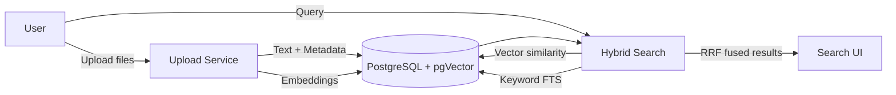

# 2nd Foundation — Your Web-based Knowledge Oracle

A searchable knowledge oracle: drag-and-drop your documents, let the app index them with embeddings and keywords, then ask natural-language questions to retrieve the best passages and files in seconds. The app runs locally or on a web server, stores data in PostgreSQL with pgVector, and uses a production-grade hybrid search that blends semantic and keyword relevance for precise, trustworthy results.

Highlights for non-ML users
- Upload PDFs, Word docs, Markdown, and text files
- Automatic embeddings + keyword indexing for fast, accurate retrieval
- Powerful hybrid search (semantic + exact keywords) with fair scoring
- Clean web UI for Search, Uploads, Results history, Testing, Admin
- Works offline (local models) or with cloud embeddings if desired
- Secure by design: sandboxed execution, input sanitization, and best-practice deployment

Navigation
- Home
- Search
- Upload
- RL Task (Overview, Submit, Results, History) — optional ML assignment feature
- Testing
- Admin

What “hybrid search” means
The app combines two complementary signals:
- Semantic similarity from vector embeddings (captures meaning)
- Keyword full‑text search from PostgreSQL (captures exact terms)
These rankings are fused using RRF (Reciprocal Rank Fusion) to fairly reward documents that rank well on either method, so you get both exact hits and conceptually relevant results at the top.

Quick start
1) Prerequisites
- Python 3.11+
- PostgreSQL 16+ with pgVector extension installed

2) Clone and install

```bash
git clone <your-repo-url> 2nd-foundation
cd 2nd-foundation
python -m venv venv
# Windows
venv\Scripts\activate
# macOS/Linux
# source venv/bin/activate
pip install -r requirements.txt
```

3) Configure environment

Copy the template and edit values as needed.

```bash
cp .env.example .env
```

Key variables in `.env`:
- FLASK_APP, FLASK_ENV, SECRET_KEY
- DATABASE_URL (primary) and TEST_DATABASE_URL (tests)
- EMBEDDING_MODEL (default: sentence-transformers/all-MiniLM-L6-v2)
- Optional: OPENAI_API_KEY, ANTHROPIC_API_KEY
- GRADER_TIMEOUT, MAX_CODE_LENGTH

4) Initialize database and test data

```bash
flask db init
flask db migrate -m "Initial migration"
flask db upgrade
flask load_test_data
```

5) Run the app

```bash
python run.py
# or with Flask
# flask run
```

6) Open the UI
Visit http://localhost:5000 and:
- Go to Upload to add PDFs/DOCX/MD/TXT
- Go to Search to ask questions and browse results
- Use Admin for stats, re-indexing, and cache management

Using the app
- Upload: Drag-and-drop, batch progress, and upload history
- Search: See real-time results with scores and open full documents
- History: Review prior searches and submissions
- Testing: Run built-in test suites and benchmarks
- Admin: Manage documents, re-index embeddings, export test data

How it works (under the hood)
- Embeddings: Documents are embedded and stored in a pgVector column for semantic search
- Keyword index: PostgreSQL full-text search uses a ts_vector column with a GIN index
- Ranking: Hybrid search fuses both rankings via reciprocal-rank scoring (RRF with k=60)
- Storage: PostgreSQL schemas include documents, search analytics, submissions, and test cases
For details, see:
- [`build_plan/plan-part-03.md`](build_plan/plan-part-03.md)
- [`build_plan/plan-part-04.md`](build_plan/plan-part-04.md)
- [`build_plan/plan-part-09.md`](build_plan/plan-part-09.md)

Architecture at a glance



Optional: RL Task (for AI model evaluation)
You can treat the app as a teaching or benchmarking harness for AI models. The RL Task pages let you display a task prompt, accept model‑generated code submissions, sandbox and grade them automatically, then visualize results and history. If you don’t need this, simply ignore the RL Task menu.
- Task definition and prompt generation: [`build_plan/plan-part-10.md`](build_plan/plan-part-10.md)
- Assignment packaging and CLI: [`build_plan/plan-part-02.md`](build_plan/plan-part-02.md), [`build_plan/plan-part-12.md`](build_plan/plan-part-12.md)
- Test data generation: [`build_plan/plan-part-07.md`](build_plan/plan-part-07.md)
- Testing strategy: [`build_plan/plan-part-13.md`](build_plan/plan-part-13.md)

Configuration reference
- Environment and config examples: [`build_plan/plan-part-06.md`](build_plan/plan-part-06.md)
- App factory, blueprints, and routes: [`build_plan/plan-part-08.md`](build_plan/plan-part-08.md)
- Requirements: [`build_plan/plan-part-11.md`](build_plan/plan-part-11.md)

Deployment (non-Docker)
- Portable options to deploy without containers
- Linux: Gunicorn behind Nginx as a systemd service
- Windows: Waitress or Gunicorn via NSSM as a Windows service
- macOS: launchd service for development
- PaaS: Render, Fly.io, Railway (managed Postgres with pgVector)
- Detailed guidance: [`build_plan/plan-part-14.md`](build_plan/plan-part-14.md)

Security checklist (essentials)
- Use environment variables for all secrets
- Enable CSRF protections for forms
- Sanitize user inputs across routes
- Rate limit endpoints
- Serve HTTPS in production
- Sandbox any untrusted code execution
- Monitor and block SQL injection attempts
- Require authentication/authorization for admin features
- Keep dependencies updated

Testing
- Unit tests cover vector search, keyword search, hybrid ranking, and empty‑query handling
- Integration tests verify the grading pipeline and detect common mistakes (like wrong RRF constants)
- See outlines and examples in: [`build_plan/plan-part-13.md`](build_plan/plan-part-13.md)

Troubleshooting tips
- If embeddings aren’t being generated, confirm EMBEDDING_MODEL and that the model is available
- If pgVector functions are missing, ensure the extension is installed and enabled
- If migrations fail, recreate the DB or run upgrade steps from a clean state
- For Windows, prefer PowerShell and ensure the virtualenv is activated before running CLI commands

Design docs index
- Overview and navigation: [`build_plan/plan-part-05.md`](build_plan/plan-part-05.md)
- Full index: [`build_plan/plan-part-00-index.md`](build_plan/plan-part-00-index.md)
- Architecture: [`build_plan/plan-part-03.md`](build_plan/plan-part-03.md)
- Database schema: [`build_plan/plan-part-04.md`](build_plan/plan-part-04.md)
- App integration and routes: [`build_plan/plan-part-08.md`](build_plan/plan-part-08.md)
- Reference hybrid search behavior: [`build_plan/plan-part-09.md`](build_plan/plan-part-09.md)
- Task definition module: [`build_plan/plan-part-10.md`](build_plan/plan-part-10.md)
- Requirements: [`build_plan/plan-part-11.md`](build_plan/plan-part-11.md)
- Entry points and CLI: [`build_plan/plan-part-12.md`](build_plan/plan-part-12.md)
- Testing strategy: [`build_plan/plan-part-13.md`](build_plan/plan-part-13.md)
- Deployment considerations: [`build_plan/plan-part-14.md`](build_plan/plan-part-14.md)

License
Choose and add a license file suitable for your use case (MIT, Apache-2.0, etc.).